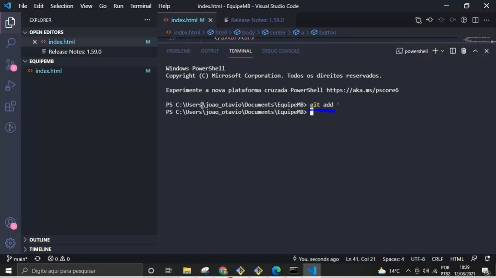

# Tutorial-Git
# GitHub 
### - Como abrir um repositório:

- No canto superior direito, clique no “+”. Logo após, clique em “New repository”.

- Destacado em vermelho, você deve colocar o nome de seu repositório. Em azul, você poderá colocar uma descrição sobre este repositório.

- Em azul, você deve escolher se o repositório será privado ou público. Depois de fazer tudo, clique em “Create repository” para cria-lo.

- Clicando em “Add file”, você poderá criar um novo arquivo “Create new file”, ou fazer upload dos arquivos “Upload files”.

### - Como colocar os colaboradores no repositório

- Clique em “Settings” para acessar as configurações do seu repositório.

- Clique em “Manage access”.

- Digite sua senha para dar continuidade no acesso.

- Clique em “Invite a collaborator” para enviar um convite para alguém.

- Digite o nome de usuário no espaço, e depois clique em “Select a collaborator above”.

### - Como habilitar o GitPages:

- Para habilitar o GitPages, o repositório já precisa ter algum arquivo.

- Clique em “Settings”.

- Clique em “Pages”.

- Clique em “None” para selecionar a branch. Em seguida clique em “main”.

- Para salvar a configuração, clique em “Save”.

- Depois de salvar, irá aparecer um aviso em azul avisando que o seu site já está publicado. O link do site estará ao lado.

# Git:
### - Como baixar Git:
- Acesse o link: https://git-scm.com/download/win

- Baixe a versão que desejar.

### Como fazer processo de commit:

- Como fazer processo de commit

- Digite “cd .\documents\”.

- Estando dentro da aba documents digite “git clone” + o link do repositório.

- Caso de um erro como o indicado na imagem. Faça o seguinte procedimento:

- Aperte a tecla Windows e digite “Editar as variáveis de ambiente para sua conta”.

- Clique duas vezes em cima da variável "path"
- 

-  Clique em “novo” e escreva as duas linhas como na imagem. Após adicionar clique no “ok"

-  Volte ao terminal e estando dentro do repositório desejado digite “git add”.

- Digite “git commit –m” + um nome para o commit entre aspas.

- Digite “git push”.

-  Após concluir o procedimento descrito acima é necessário apenas atualizar a página.

